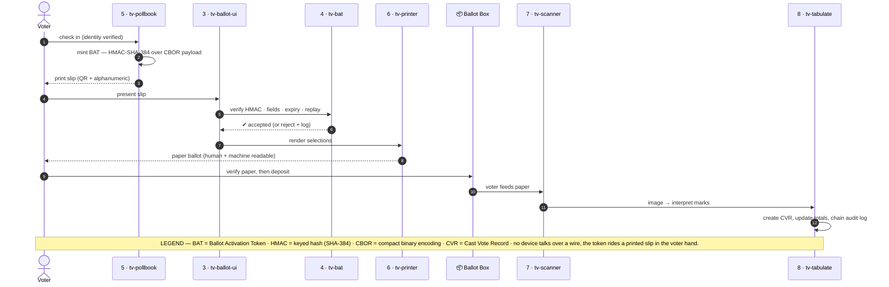

# Module Map

A one-screen picture of how TrustVoting fits together — the **21 crates** across **four trust zones**, and how data flows between them during a real election.

> **The core idea:** data crosses a zone boundary **only on signed, sealed, hand-carried media** — never over a network. Follow the arrows and you're following a USB stick in a tamper-evident bag, logged by two people.

New here? Jump to [Where to start](#where-to-start-for-contributors).

---

## The whole system at a glance

```mermaid
flowchart LR
    formats["<b>tv-formats</b><br/><small>shared wire schemas:<br/>EDC · SAC · PVP · CVR · BAT<br/>Apache-2.0 — spoken by every zone</small>"]

    subgraph COUNTYA["🏛️ COUNTY HQ — before election · AGPL-3.0"]
        direction TB
        ems["14 · tv-ems<br/><small>ballot design, contests,<br/>precinct mapping</small>"]
        defsign["15 · tv-def-sign<br/><small>test suite → DTR,<br/>sign EDC + TAK_seed</small>"]
        updatestation["18 · tv-update-station<br/><small>install SAC-validated<br/>images (ceremony)</small>"]
        ems --> defsign
    end

    subgraph PRECINCT["🗳️ PRECINCT — air-gapped, NO network · AGPL-3.0 · crates/device/"]
        direction TB
        admin["11 · tv-admin<br/><small>open/close polls, export trigger</small>"]
        subgraph FLOW["voter path (left → right)"]
            direction LR
            pollbook["5 · tv-pollbook<br/><small>check-in, issue+sign BAT,<br/>print slip</small>"]
            ballotui["3 · tv-ballot-ui<br/><small>touchscreen BMD<br/>(needs valid BAT)</small>"]
            bat["4 · tv-bat<br/><small>verify BAT:<br/>HMAC, replay, rate</small>"]
            printer["6 · tv-printer<br/><small>render + thermal print</small>"]
            box(["📦 BALLOT BOX<br/><b>paper = ground truth</b>"])
            scanner["7 · tv-scanner<br/><small>optical scan,<br/>mark interpret</small>"]
            tabulate["8 · tv-tabulate<br/><small>contest rules,<br/>CVR creation</small>"]
            pollbook -->|"BAT slip (QR)"| ballotui
            ballotui --> bat
            ballotui --> printer
            printer -->|prints| box
            box -->|voter feeds| scanner
            scanner --> tabulate
        end
        subgraph CORE["every device also runs this security core"]
            direction LR
            boot["1 · tv-boot<br/><small>secure boot, TPM</small>"]
            os["2 · tv-os<br/><small>immutable OS,<br/>SELinux</small>"]
            audit["9 · tv-audit-log<br/><small>append-only,<br/>hash-chained</small>"]
            tamper["13 · tv-tamper<br/><small>controller,<br/>quarantine</small>"]
            export["10 · tv-export<br/><small>signed bundle →<br/>sealed media</small>"]
            update["12 · tv-update<br/><small>offline update<br/>verifier</small>"]
        end
        admin -.->|open / close| pollbook
        admin -.->|open / close| tabulate
    end

    subgraph COUNTYB["🏛️ COUNTY HQ — after election · AGPL-3.0"]
        direction TB
        aggregator["16 · tv-aggregator<br/><small>import + verify bundles,<br/>aggregate, canvass pkg</small>"]
        ops["17 · tv-ops-dashboard<br/><small>status, alerts,<br/>anomaly (advisory)</small>"]
    end

    subgraph PUBLIC["🌍 PUBLIC VERIFICATION — read-only · Apache-2.0 · crates/public/"]
        direction TB
        publisher["21 · tv-publisher<br/><small>publish artifacts<br/>(one-way, no control)</small>"]
        tlog["20 · tv-transparency-log<br/><small>Merkle log,<br/>inclusion proofs</small>"]
        verifier["19 · tv-verifier<br/><small>anyone verifies<br/>EDC/SAC/PVP</small>"]
        publisher --> tlog
        publisher --> verifier
    end

    %% one-way flow, left → right (sealed, hand-carried media)
    formats -.->|schemas| COUNTYA
    defsign ==>|"① EDC + TAK_seed<br/>🔒 sealed media · AIR GAP"| pollbook
    updatestation ==>|"signed image + SAC<br/>🔒 sealed media"| update
    export ==>|"② signed export bundles<br/>🔒 sealed media · AIR GAP"| aggregator
    tabulate -. telemetry (no votes) .-> ops
    aggregator ==>|"③ canvass + PVP<br/>one-way publish ▶"| publisher

    subgraph LEGEND["📖 LEGEND"]
        direction TB
        lg1["🟦 AGPL-3.0 — core (device + county)"]:::agpl
        lg2["🟩 Apache-2.0 — public verification layer"]:::apache
        lg3["🟨 Apache-2.0 — tv-formats shared schemas"]:::shared
        lg4["══▶ signed, sealed, hand-carried media (air-gap crossing)<br/>①②③ the three hops = the whole election<br/>EDC election def · SAC software cert · BAT ballot token<br/>CVR vote record · PVP public verification package"]:::paper
        lg1 ~~~ lg2 ~~~ lg3 ~~~ lg4
    end

    classDef agpl fill:#dbeafe,stroke:#2563eb,stroke-width:1px,color:#111;
    classDef apache fill:#dcfce7,stroke:#16a34a,stroke-width:1px,color:#111;
    classDef shared fill:#fef9c3,stroke:#ca8a04,stroke-width:1px,color:#111;
    classDef paper fill:#fff,stroke:#111,stroke-width:2px,color:#111;

    class ems,defsign,updatestation,aggregator,ops,boot,os,audit,tamper,export,update,pollbook,ballotui,bat,printer,scanner,tabulate,admin agpl;
    class publisher,tlog,verifier apache;
    class formats shared;
    class box paper;
```



**Colour = licence.** 🟦 Blue = **AGPL-3.0** core (device + county) · 🟩 Green = **Apache-2.0** public layer · 🟨 Yellow = **Apache-2.0** shared formats. Every file carries an authoritative `SPDX-License-Identifier` header — see [licensing-strategy.md](licensing-strategy.md).

**The three numbered hops are the whole election:**
1. **County → Precinct** — the signed election definition (**EDC**) is hand-carried to air-gapped devices.
2. **Precinct → County** — each device's **signed export bundle** (totals, CVRs, audit chain) is hand-carried back.
3. **County → Public** — the canvass and **Public Verification Package (PVP)** are published one-way so *anyone* can re-check the result.

---

## Election Day, zoomed in

The heart of the system is the **Ballot Activation Token (BAT)** — the cryptographic link that stops a machine from printing ballots the pollbook never authorised. No device talks to another over a wire; the token rides a printed slip in the voter's hand.



> Every step above is written to the device's **append-only, hash-chained audit log** (`9 · tv-audit-log`), and the whole device is watched by the hardware **tamper** controller (`13 · tv-tamper`) — a forbidden event sets an irreversible flag and quarantines the unit. See [architecture.md](architecture.md) for the full BAT protocol, reconciliation equations, and rogue-device defence-in-depth.

---

## The 21 crates (+ shared formats)

| # | Crate | Zone | Licence | Role |
|---|-------|------|---------|------|
| 1 | `tv-boot` | Device | AGPL-3.0 | Secure boot chain, TPM measurement, key unsealing |
| 2 | `tv-os` | Device | AGPL-3.0 | Immutable base OS, SELinux policy, namespace setup |
| 3 | `tv-ballot-ui` | Device (BMD) | AGPL-3.0 | Touchscreen ballot interface; needs a valid BAT to start a session |
| 4 | `tv-bat` | Device (BMD) | AGPL-3.0 | BAT verification: QR scan, HMAC-SHA-384, replay + rate checks |
| 5 | `tv-pollbook` | Device | AGPL-3.0 | Voter check-in, roster, BAT generation + signing, slip printing |
| 6 | `tv-printer` | Device (BMD) | AGPL-3.0 | Ballot rendering and thermal print / paper-path control |
| 7 | `tv-scanner` | Device (Tabulator) | AGPL-3.0 | Optical scan pipeline: image capture, mark interpretation |
| 8 | `tv-tabulate` | Device (Tabulator) | AGPL-3.0 | Tabulation engine: contest rules, Cast Vote Record (CVR) creation |
| 9 | `tv-audit-log` | Device | AGPL-3.0 | Append-only, hash-chained audit log with signed checkpoints |
| 10 | `tv-export` | Device | AGPL-3.0 | Signed export-bundle creation and sealed-media write |
| 11 | `tv-admin` | Device | AGPL-3.0 | Admin console: open/close polls, device status, export trigger |
| 12 | `tv-update` | Device | AGPL-3.0 | Offline update verifier (maintenance mode only) |
| 13 | `tv-tamper` | Device | AGPL-3.0 | Hardware security-controller interface, irreversible quarantine |
| 14 | `tv-ems` | County | AGPL-3.0 | Election definition authoring, ballot design, precinct management |
| 15 | `tv-def-sign` | County | AGPL-3.0 | Definition test suite, DTR generation, EDC signing |
| 16 | `tv-aggregator` | County | AGPL-3.0 | Import + verify precinct bundles, aggregate totals, build canvass |
| 17 | `tv-ops-dashboard` | County | AGPL-3.0 | Real-time precinct status, alerts, anomaly detection (advisory) |
| 18 | `tv-update-station` | County | AGPL-3.0 | Install signed updates to devices (maintenance ceremony) |
| 19 | `tv-verifier` | Public | Apache-2.0 | Public CLI/library to verify EDC, SAC, PVP, and device records |
| 20 | `tv-transparency-log` | Public | Apache-2.0 | Append-only Merkle log for EDC/SAC commitments + inclusion proofs |
| 21 | `tv-publisher` | Public | Apache-2.0 | Publish verification artifacts to trustvoting.com (one-way) |
| — | `tv-formats` | Shared | Apache-2.0 | Open, versioned wire schemas shared by the core and any 3rd-party verifier |

---

## Glossary — the artifacts on the arrows

| Term | Meaning |
|------|---------|
| **EDC** | **Election Definition Certificate** — the signed ballot definition + per-precinct device whitelist + `TAK_seed` hash. |
| **SAC** | **Software Assurance Certificate** — binds a signed software image to its test + security evidence. |
| **BAT** | **Ballot Activation Token** — HMAC-SHA-384 token issued by a pollbook, verified by a BMD, that authorises one ballot session. |
| **TAK** | **Token Authentication Key** — per-precinct key derived via HKDF-SHA-384 from the `TAK_seed` in the EDC. |
| **CVR** | **Cast Vote Record** — the machine's interpretation of one scanned paper ballot. |
| **PVP** | **Public Verification Package** — the bundle published so anyone can independently verify the outcome. |
| **DTR** | **Definition Test Report** — evidence that an election definition passed the test suite before signing. |

---

## Where to start (for contributors)

The system is early — **most crates are scaffolds today** and land incrementally in the open. Good places to jump in, roughly easiest first:

- 🟢 **`tv-formats`** (Apache-2.0, dependency-light) — the wire schemas everything else speaks. Touching this teaches you the whole data model, and it's the friendliest licence for a first PR.
- 🟢 **`tv-verifier`** (Apache-2.0) — a standalone CLI that re-checks published artifacts. Self-contained, high-impact, no hardware needed.
- 🟦 **`tv-tabulate`** / **`tv-audit-log`** (AGPL-3.0) — pure logic (contest rules, hash chains) that runs and tests without any device hardware.

Read [`CONTRIBUTING.md`](../CONTRIBUTING.md) first — crates under `crates/device/**` and `crates/county/**` are **AGPL-3.0**; `crates/public/**` and `crates/shared/**` are **Apache-2.0**. Build the whole workspace with `cargo build && cargo test`, or one crate with `cargo build -p tv-verifier`.

> This diagram is **Mermaid source** — edit it in a PR, no image tooling required. If a module's role changes, update the flowchart and the table in the same commit.
```

